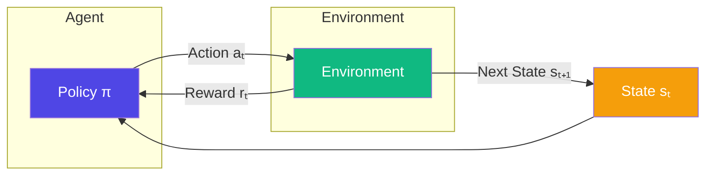
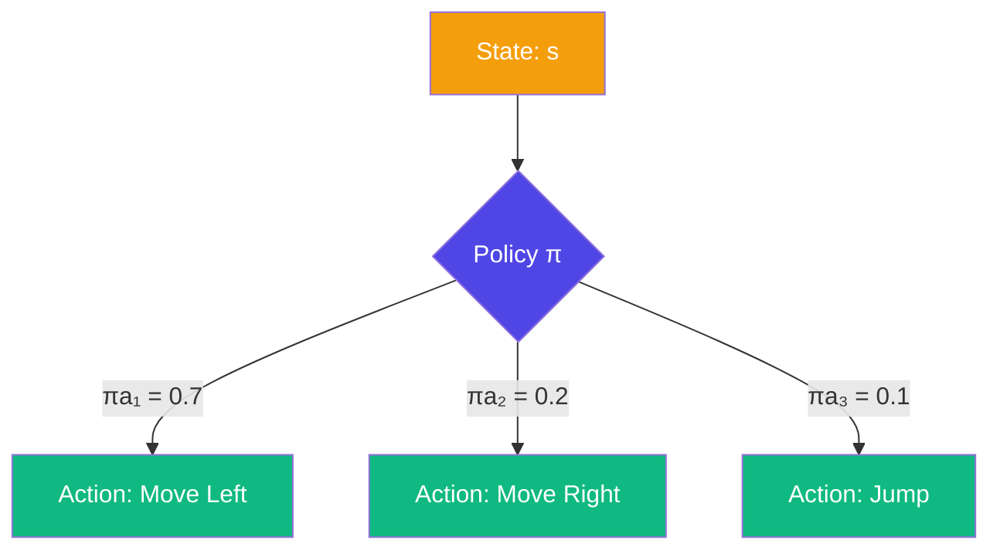
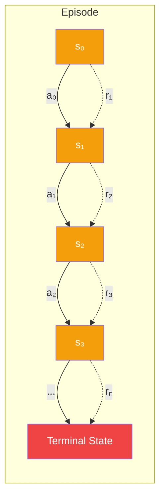
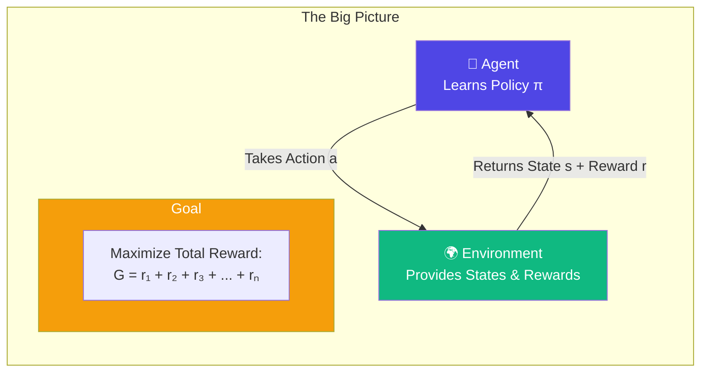

# Chapter 1: The Big Picture — What is Reinforcement Learning?

> **Reinforcement Learning (RL)** is the science of learning by doing. An agent interacts with an environment, receives feedback in the form of rewards, and learns a strategy (policy) to maximize long-term success.

---

## 🎯 Core Concepts

| Concept | Definition | Analogy |
|---------|-----------|---------|
| **Agent** | The learner / decision-maker | A robot, a game-playing AI, a trading bot |
| **Environment** | The world the agent lives in | A chess board, a maze, the stock market |
| **State (S)** | A snapshot of the environment right now | Position of pieces on a board |
| **Action (A)** | What the agent *does* | Move left, buy stock, jump |
| **Reward (R)** | Feedback from the environment | +10 for winning, −1 for losing |
| **Policy (π)** | The agent's strategy | "If state X, do action Y" |

---

## 🔄 The RL Loop

At every step, the agent and environment engage in a continuous feedback loop:

**The cycle:**
1. The agent observes the current **state** $s_t$
2. The agent chooses an **action** $a_t$ based on its **policy** $π$
3. The environment returns a **reward** $r_t$ and transitions to a new **state** $s_{t+1}$
4. The agent updates its policy to do better next time

---

## 🧠 The Policy: The Agent's "Brain"

The policy $π$ is the core of any RL agent. It maps states to actions:

A policy can be:
- **Deterministic** — always picks the same action for a given state
- **Stochastic** — assigns probabilities to actions (useful for exploration)

---

## 💰 Reward: The Signal to Learn

Rewards are the only feedback the agent gets. The goal is to maximize **cumulative reward** over time:

> **Good reward** → "Do that again!"  
> **Bad reward** → "Avoid that in the future!"

---

## 🏗️ Putting It All Together

---

## 📝 Key Takeaways

| Idea | One-Liner |
|------|-----------|
| **Trial & Error** | RL is learning from experience, not from labeled data |
| **Delayed Gratification** | A good action now might lead to a big reward later |
| **Exploration vs Exploitation** | Try new things, or stick with what works? |
| **Policy is Everything** | The end goal is to find the best strategy for every situation |

---

## 🔗 Next Up

> **Chapter 2** — Markov Decision Processes (MDPs): The mathematical foundation that formalizes states, actions, rewards, and transitions.

---

*Happy Learning! 🚀*
