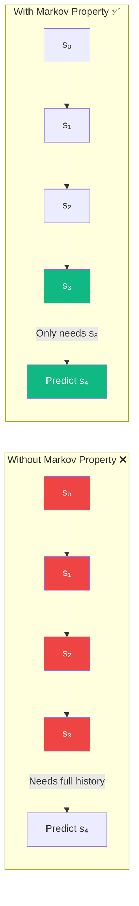
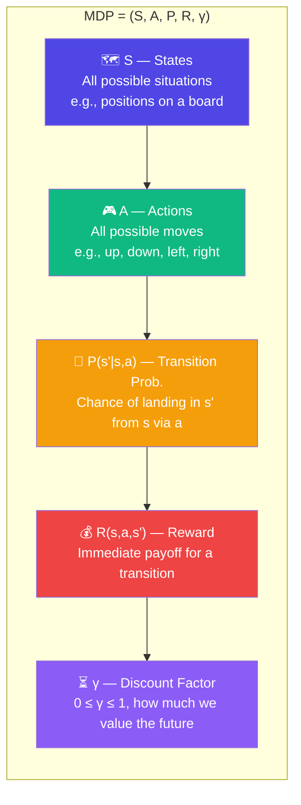
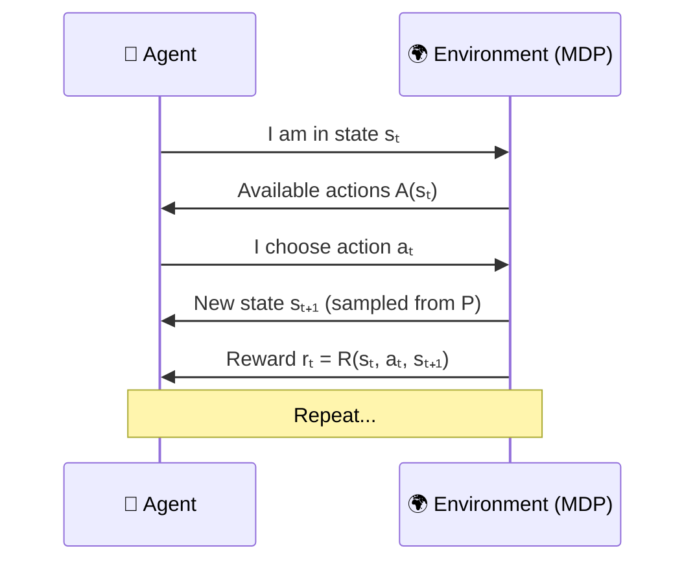
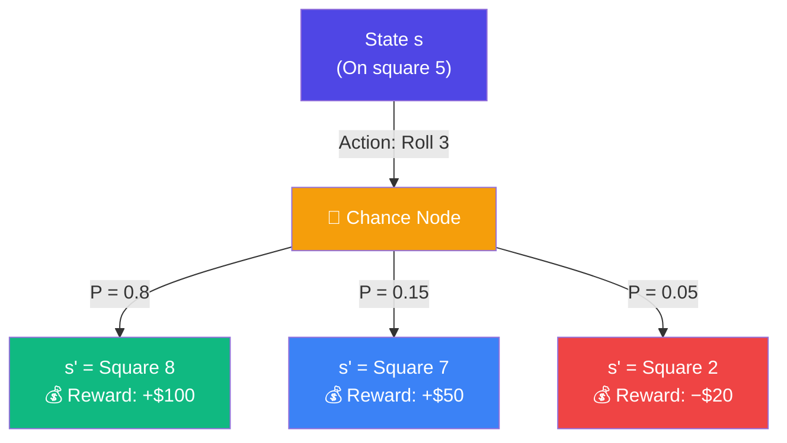
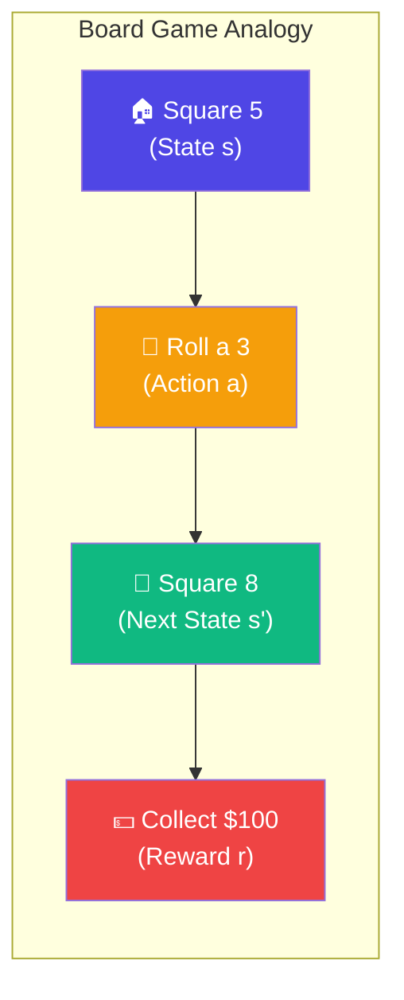
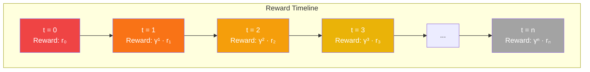
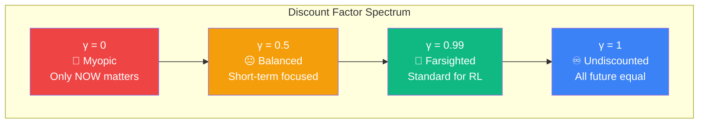
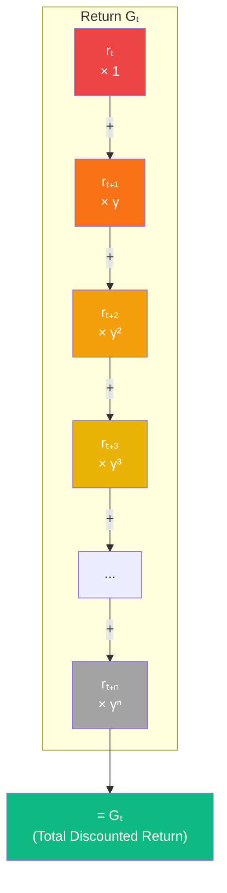

# Chapter 2: Markov Decision Processes (MDPs)

> **MDPs** are the mathematical backbone of Reinforcement Learning. They provide a clean, formal way to describe how an agent interacts with an environment — defining states, actions, transitions, rewards, and how we value the future.

---

## 🎯 The Markov Property

> *"The future depends only on the present, not the past."*

If you know the **current state**, you don't need the full history to predict what happens next. The past is irrelevant once the present is known.



**Mathematically:**

$$P(s_{t+1} | s_t, a_t) = P(s_{t+1} | s_t, a_t, s_{t-1}, a_{t-1}, ..., s_0, a_0)$$

---

## 🧩 The MDP Tuple: (S, A, P, R, γ)

An MDP is fully defined by five components:



| Symbol | Name | What It Means |
|--------|------|---------------|
| **S** | State Space | The set of all possible states the environment can be in |
| **A** | Action Space | The set of all possible actions the agent can take |
| **P(s'\|s,a)** | Transition Probability | Probability of ending up in state $s'$ after taking action $a$ in state $s$ |
| **R(s,a,s')** | Reward Function | The immediate reward received for transitioning from $s$ to $s'$ via action $a$ |
| **γ** | Discount Factor | A number between 0 and 1 that determines how much we care about future vs. immediate rewards |

---

## 🔄 The MDP Transition Cycle

At every timestep, the MDP follows this exact pattern:



```mermaid
flowchart LR
    S[sₜ] -->|Choose aₜ| A
    A -->|P(sₜ₊₁|sₜ,aₜ)| S2[sₜ₊₁]
    S2 -->|R(sₜ,aₜ,sₜ₊₁)| R[rₜ]
    S2 --> S

    style S fill:#4f46e5,color:#fff
    style A fill:#10b981,color:#fff
    style S2 fill:#4f46e5,color:#fff
    style R fill:#ef4444,color:#fff
```

---

## 🎲 Transition Probabilities in Action

Not all actions have guaranteed outcomes. The environment can be stochastic:



> **Key insight:** Even with the same action, different outcomes are possible. The agent must learn to handle uncertainty.

---

## 🎲 Simple Analogy: MDP as a Board Game Rulebook

> MDP is like a board game rulebook. It tells you: *"If you're on square 5 (state) and roll a 3 (action), you'll land on square 8 (next state) and collect $100 (reward)."*



---

## ⏳ Why γ (Gamma) Matters

The discount factor $γ$ controls how much the agent values future rewards compared to immediate ones.



### The Three Cases

| γ Value | Behavior | Analogy |
|---------|----------|---------|
| **γ = 0** | Agent is greedy. Only cares about **now**. | "A bird in the hand is worth two in the bush." |
| **γ = 1** | Agent cares about **all future rewards equally**. No discounting. | "A dollar today is worth exactly a dollar in 10 years." |
| **γ = 0.99** | **Standard choice.** Future matters, but immediate rewards still count more. | "Inflation exists — $100 today is worth more than $100 next year." |



> **The discount factor $γ$ is like inflation** — $100 today is worth more than $100 next year.

---

## 🏗️ The Return: Total Discounted Reward

The agent's goal is to maximize the **expected return** — the sum of all discounted future rewards:

$$G_t = r_t + \gamma r_{t+1} + \gamma^2 r_{t+2} + \gamma^3 r_{t+3} + ... = \sum_{k=0}^{\infty} \gamma^k r_{t+k}$$



---

## 📝 Key Takeaways

| Idea | One-Liner |
|------|-----------|
| **Markov Property** | The future depends only on the present state — history doesn't matter |
| **MDP Tuple** | (S, A, P, R, γ) fully describes any RL problem |
| **Stochastic Transitions** | Actions can have uncertain outcomes; P(s'\|s,a) captures this |
| **Discount Factor γ** | Controls the trade-off between immediate and future rewards |
| **Return Gₜ** | The sum of all discounted future rewards — what the agent tries to maximize |

---

## 🔗 Next Up

> **Chapter 3** — Value Functions: How good is a state? How good is an action in a state? Introducing $V(s)$ and $Q(s,a)$.

---

*Happy Learning! 🚀*
