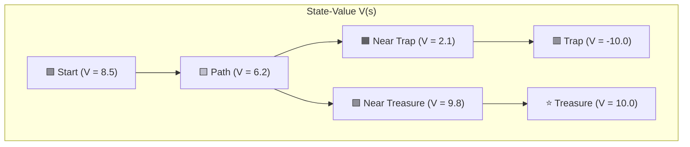
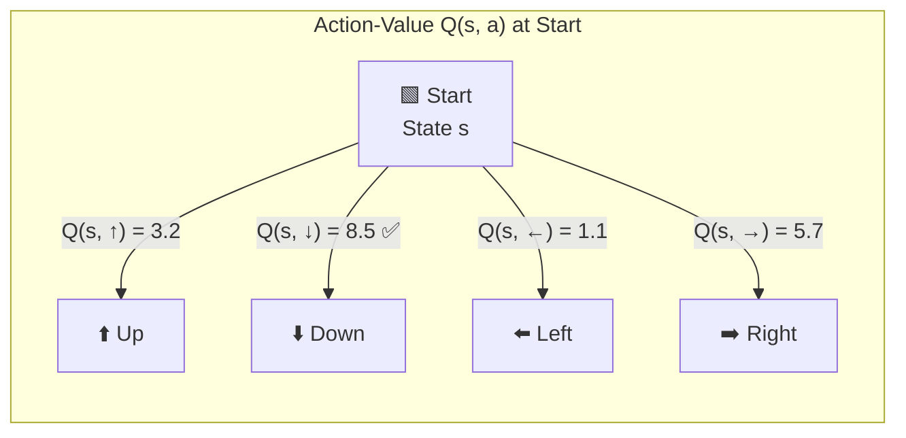
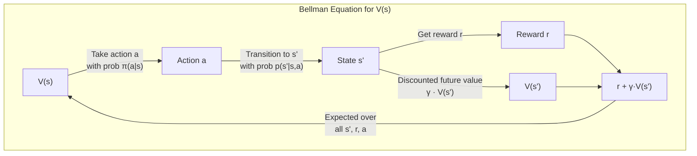
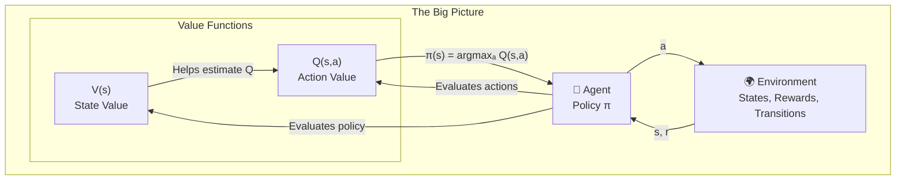

# Chapter 3: Value Functions — "How Good Is This State?"

> **Goal:** Learn how to measure the "goodness" of states and actions so an agent can make smart decisions.

---

## 📐 Core Concepts

### 1. Return (Gₜ)

The **Return** is the total discounted reward you collect from time step `t` onward.

```
Gₜ = rₜ₊₁ + γ·rₜ₊₂ + γ²·rₜ₊₃ + γ³·rₜ₊₄ + ...
```

| Symbol | Meaning |
|--------|---------|
| `Gₜ` | Return from time `t` |
| `rₜ₊₁` | Reward received after taking action at time `t` |
| `γ` (gamma) | Discount factor, `0 ≤ γ ≤ 1` |

> 💡 **Why discount?** A reward today is worth more than the same reward tomorrow. `γ` controls how much we care about future rewards.

---

### 2. State-Value Function V(s)

The **State-Value Function** tells you the expected return if you start in state `s` and follow policy `π` forever.

```
Vπ(s) = E[Gₜ | sₜ = s]
```

> 🎯 **In plain English:** *"If I'm standing here, how much money will I make on average if I keep playing?"*

---

### 3. Action-Value Function Q(s, a)

The **Action-Value Function** tells you the expected return if you start in state `s`, take action `a` **once**, and then follow policy `π` forever after.

```
Qπ(s, a) = E[Gₜ | sₜ = s, aₜ = a]
```

> 🎯 **In plain English:** *"If I'm standing here and I specifically choose to go left, how much money will I make?"*

---

## 🔄 V(s) vs Q(s, a)

| | **V(s)** | **Q(s, a)** |
|---|---|---|
| **Measures** | How good a **state** is | How good an **action** is **in a state** |
| **Input** | Just the state `s` | State `s` + action `a` |
| **Output** | A single number (expected return) | A single number (expected return) |
| **Use case** | Evaluate states | Choose the best action |

> 🔑 **Key Insight:** If you know `Q(s, a)`, you can derive the optimal policy directly:
>
> ```
> π(s) = argmaxₐ Q(s, a)
> ```
> *"Pick the action with the highest Q-value in this state."*

---

## 🗺️ Visual Analogy: The Treasure Map

Imagine you're on a grid trying to find treasure. Each cell is a **state**, and each move is an **action**.



> `V(s)` tells you the expected score from each cell if you keep moving optimally.

---

## 🎯 Q-Values in Action



> The agent picks **Down** because `Q(s, ↓) = 8.5` is the highest. That's the optimal action!

---

## 🔗 The Bellman Equation (The Heart of RL)

Value functions satisfy a recursive relationship called the **Bellman Equation**.

### For V(s):

```
Vπ(s) = Σ π(a|s) · Σ p(s', r | s, a) · [r + γ · Vπ(s')]
        a        s',r
```

### For Q(s, a):

```
Qπ(s, a) = Σ p(s', r | s, a) · [r + γ · Σ π(a'|s') · Qπ(s', a')]
           s',r                     a'
```



> 🧠 **Intuition:** The value of where you are now equals the expected reward you get next + the discounted value of where you end up.

---

## 🎰 Casino Analogy

| RL Concept | Casino Equivalent |
|---|---|
| **State `s`** | Which table you're sitting at |
| **Action `a`** | Which bet you place |
| **Reward `r`** | Money won or lost on that bet |
| **V(s)** | *"If I sit at this table and play my usual strategy, what's my expected net profit?"* |
| **Q(s, a)** | *"If I sit at this table and bet on red *right now*, what's my expected net profit?"* |
| **π(s) = argmaxₐ Q(s, a)** | *"Always bet on the option with the highest expected return at this table."* |

---

## 📊 Summary Diagram



---

## ✅ Key Takeaways

1. **Return Gₜ** = Sum of discounted future rewards from time `t`.
2. **V(s)** = Expected return starting from state `s` and following policy `π`.
3. **Q(s, a)** = Expected return starting from state `s`, taking action `a` once, then following `π`.
4. **V** evaluates *states*; **Q** evaluates *actions in states*.
5. If you know **Q**, you can derive the optimal policy: always pick the action with the highest Q-value.
6. Both satisfy the **Bellman Equation** — a recursive relationship that connects current and future values.

---

> 📖 **Next Chapter:** *Chapter 4 — Bellman Equations & Dynamic Programming*
