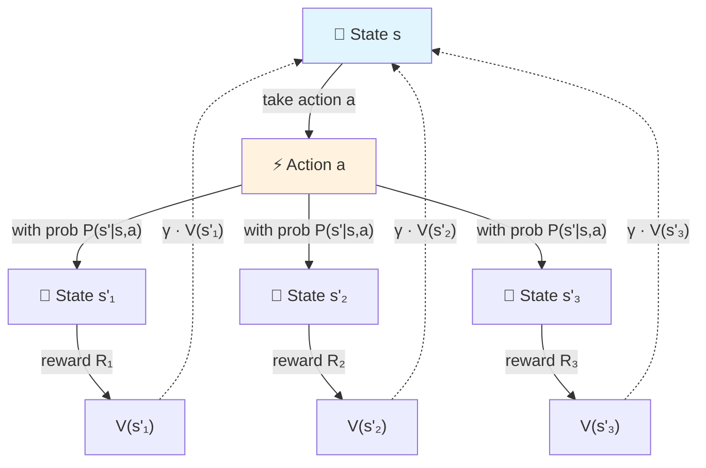
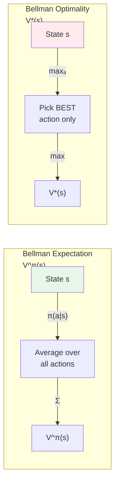
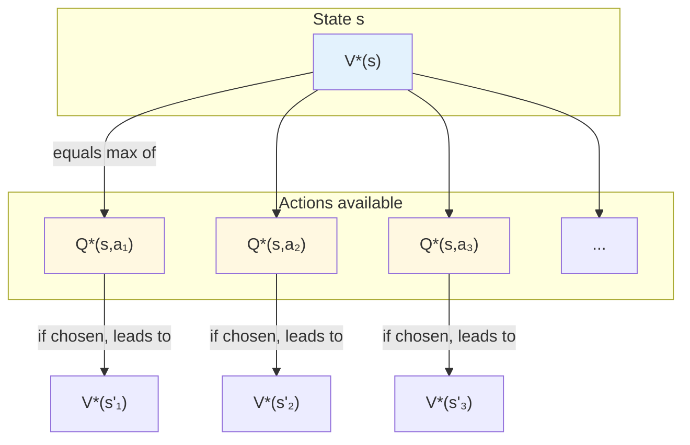
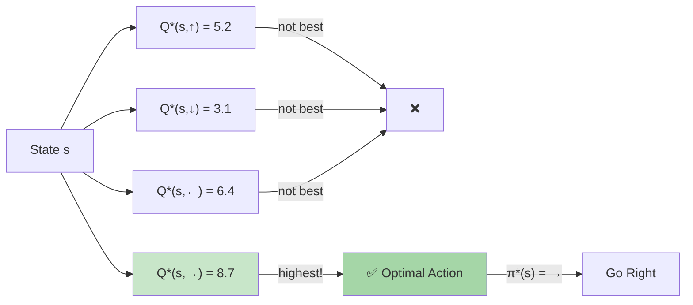
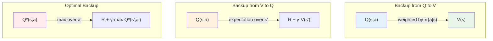
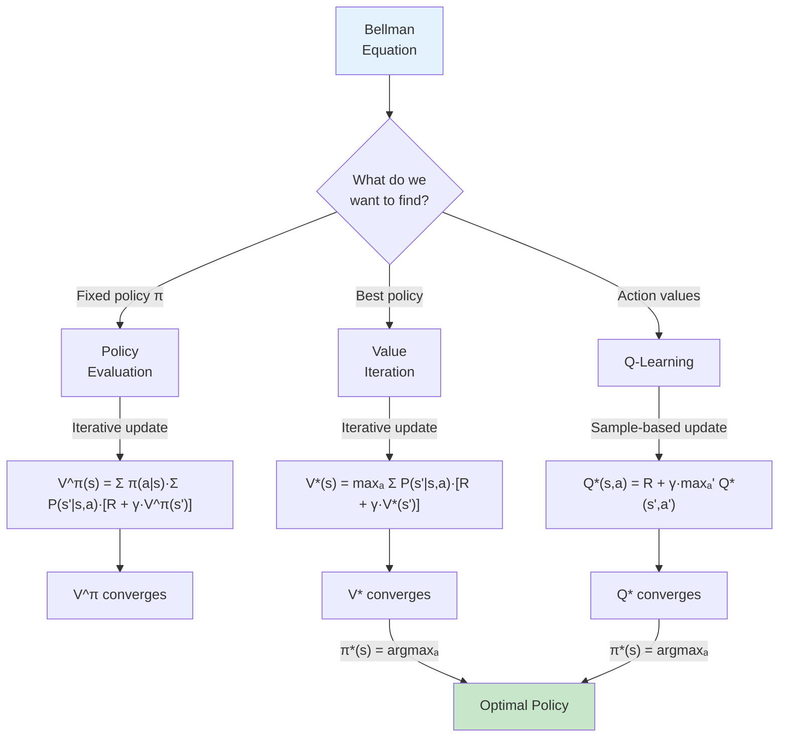

# Chapter: Bellman Equations in Reinforcement Learning

> *"The value of where you are = the reward you get now + the value of where you end up."*

---

## Table of Contents

1. [The Core Idea](#1-the-core-idea)
2. [The Three Fundamental Equations](#2-the-three-fundamental-equations)
3. [Visual Intuition](#3-visual-intuition)
4. [Key Definitions](#4-key-definitions)
5. [From Equations to Algorithms](#5-from-equations-to-algorithms)
6. [The Big Picture](#6-the-big-picture)
7. [One-Sentence Takeaways](#7-one-sentence-takeaways)

---

## 1. The Core Idea

The Bellman equation is the **mathematical backbone** of Reinforcement Learning. It breaks the problem of finding optimal behavior into smaller, recursive subproblems.

Instead of trying to figure out the *entire* future at once, the Bellman equation says:

> **"The value of a state depends only on the immediate reward plus the value of the next state."**

This recursive property is what makes RL tractable — we can solve big problems by bootstrapping from smaller ones.

---

## 2. The Three Fundamental Equations

### 2.1 Bellman Expectation Equation for V<sup>π</sup>

Describes the value of following a **specific policy** π:

```
V^π(s) = Σₐ π(a|s) · Σₛ' P(s'|s,a) · [R(s,a,s') + γ·V^π(s')]
```

| Term | Meaning |
|------|---------|
| `π(a\|s)` | Probability of taking action `a` in state `s` under policy π |
| `P(s'\|s,a)` | Probability of transitioning to state `s'` |
| `R(s,a,s')` | Immediate reward received |
| `γ` | Discount factor (0 ≤ γ ≤ 1) |
| `V^π(s')` | Value of the next state (recursive!) |

---

### 2.2 Bellman Optimality Equation for V*

Describes the **best possible value** from any state:

```
V*(s) = maxₐ Σₛ' P(s'|s,a) · [R(s,a,s') + γ·V*(s')]
```

> Instead of averaging over actions (like the expectation equation), we **take the maximum** — because an optimal agent always picks the best action.

---

### 2.3 Bellman Optimality Equation for Q*

Describes the **best possible value** of taking a specific action:

```
Q*(s,a) = Σₛ' P(s'|s,a) · [R(s,a,s') + γ·maxₐ' Q*(s',a')]
```

> Once you know Q*, the optimal policy is trivial: **always pick the action with the highest Q-value.**

---

## 3. Visual Intuition

### 3.1 The Recursive Nature



> **Key Insight:** The value of state `s` flows back from the values of all possible next states `s'`.

---

### 3.2 Policy Evaluation vs. Optimality



> **The only difference:** Expectation *averages* over actions (weighted by policy), while Optimality *maximizes* over actions.

---

### 3.3 V* vs Q* Relationship



> **V*(s) = maxₐ Q*(s,a)** — The best state value is simply the best action value available from that state.

---

### 3.4 The Optimal Policy from Q*



> **Optimal Policy:** π*(s) = argmaxₐ Q*(s,a) — Always pick the action with the highest Q-value.

---

### 3.5 Full MDP Backup Diagram



---

## 4. Key Definitions

| Symbol | Name | Meaning |
|--------|------|---------|
| **V<sup>π</sup>(s)** | State-Value Function | Expected return when starting from state `s` and following policy π |
| **V*(s)** | Optimal State-Value | Best possible expected return from state `s` |
| **Q<sup>π</sup>(s,a)** | Action-Value Function | Expected return when taking action `a` in state `s`, then following policy π |
| **Q*(s,a)** | Optimal Action-Value | Best possible expected return after taking action `a` in state `s` |
| **π*(s)** | Optimal Policy | The policy that achieves V*(s): π*(s) = argmaxₐ Q*(s,a) |

---

## 5. From Equations to Algorithms



---

## 6. The Big Picture

```
┌─────────────────────────────────────────────────────────────┐
│                    BELLMAN EQUATIONS                         │
├─────────────────────────────────────────────────────────────┤
│                                                             │
│   EXPECTATION          vs.           OPTIMALITY              │
│                                                             │
│   V^π(s) = E[R + γV^π(s')]        V*(s) = max E[R + γV*(s')]│
│          ↑                                ↑                 │
│   "Follow policy π"                "Be as smart as possible" │
│                                                             │
│   ┌─────────────┐                  ┌─────────────┐         │
│   │  POLICY     │                  │   VALUE     │         │
│   │ EVALUATION  │                  │  ITERATION  │         │
│   └─────────────┘                  └─────────────┘         │
│                                                             │
│   Q^π(s,a) = E[R + γV^π(s')]     Q*(s,a) = E[R + γmaxQ*]  │
│          ↑                                ↑                 │
│   "How good is this                "How good is this        │
│    action under π?"                action if we're         │
│                                      optimal after?"        │
│                                                             │
└─────────────────────────────────────────────────────────────┘
```

---

## 7. One-Sentence Takeaways

- **V<sup>π</sup>** tells you how good it is to be in a state *if you keep following policy π*.
- **V*** tells you how good it is to be in a state *if you act perfectly from now on*.
- **Q*** tells you how good each *action* is — so you can simply pick the best one.
- The **recursive structure** (value depends on value) is what lets us solve RL problems iteratively.

---

*End of Chapter*
