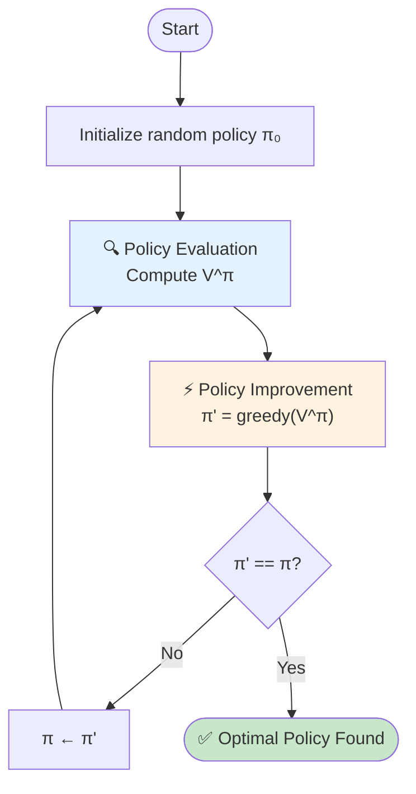
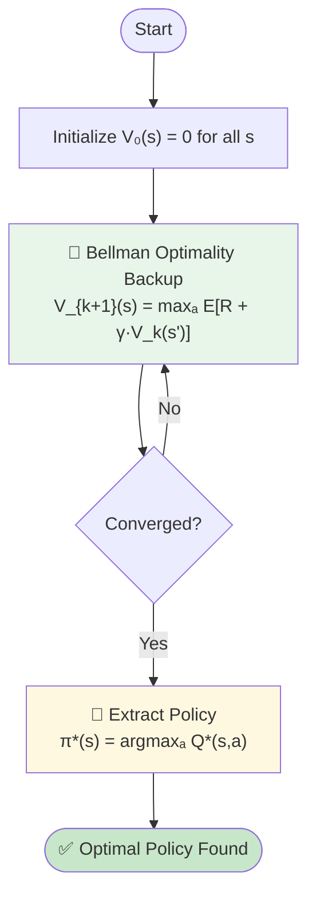
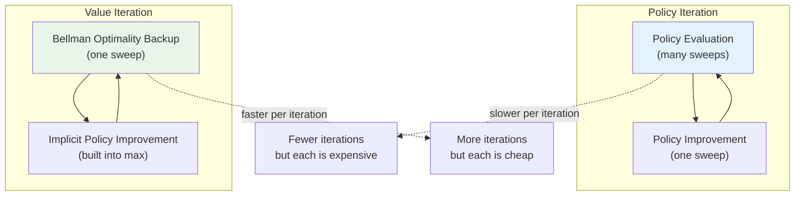
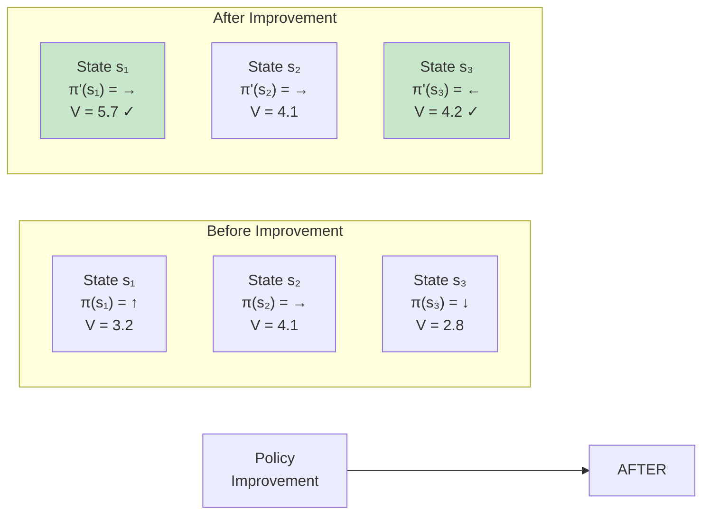
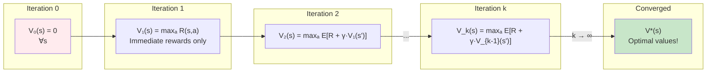
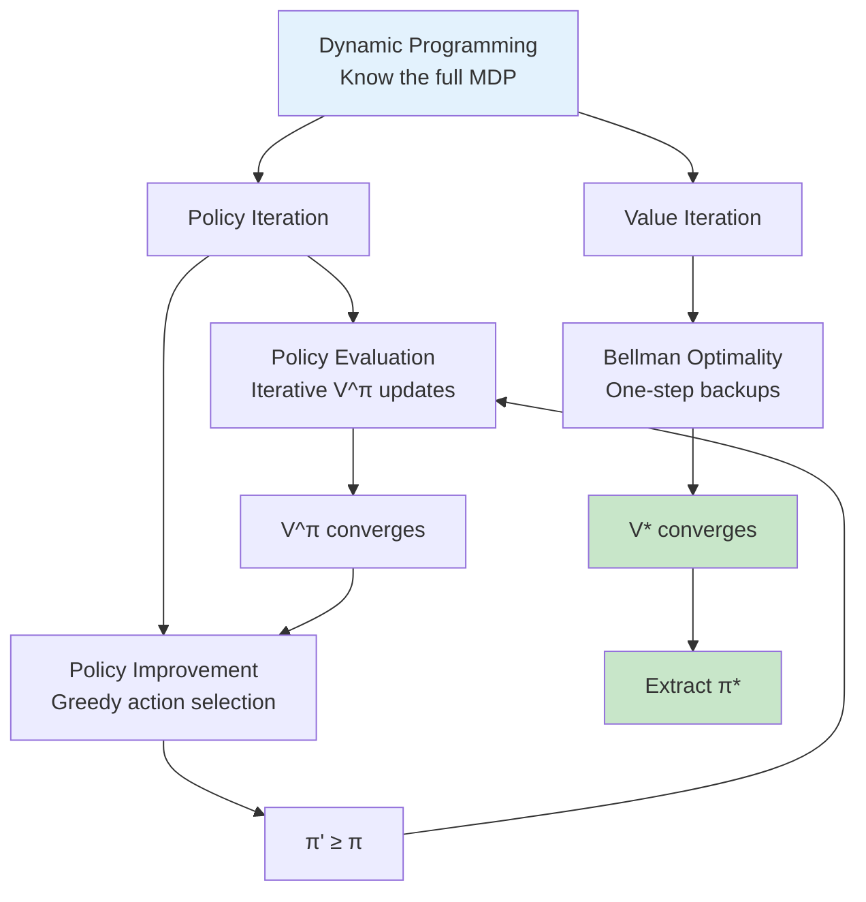

# Chapter 5: Dynamic Programming — Solving RL When You Know Everything

> *"If you know the rules of the game perfectly, you can compute the perfect strategy."*

---

## Table of Contents

1. [The Core Idea](#1-the-core-idea)
2. [Policy Iteration](#2-policy-iteration)
3. [Value Iteration](#3-value-iteration)
4. [Visual Intuition](#4-visual-intuition)
5. [Comparison](#5-comparison)
6. [Pseudocode](#6-pseudocode)
7. [Key Limitation](#7-key-limitation)
8. [One-Sentence Takeaways](#8-one-sentence-takeaways)

---

## 1. The Core Idea

Dynamic Programming (DP) is a collection of algorithms that **solve MDPs exactly** when the full model is known — i.e., you have access to all transition probabilities `P(s'|s,a)` and rewards `R(s,a,s')`.

DP exploits the recursive structure of the Bellman equations to iteratively improve solutions until convergence.

> **Two main approaches:**
> - **Policy Iteration** — Alternate between evaluating a policy and improving it.
> - **Value Iteration** — Skip explicit policies; directly compute optimal values, then extract the policy.

---

## 2. Policy Iteration

### The Loop

```
1. Start with any policy π₀
2. Policy Evaluation:    Compute V^π using Bellman expectation equation
3. Policy Improvement:   Update π to be greedy w.r.t. V^π
4. Repeat until π stops changing
```

### Policy Evaluation

Iteratively apply the Bellman expectation equation until V converges:

```
V_{k+1}(s) = Σₐ π(a|s) · Σₛ' P(s'|s,a) · [R(s,a,s') + γ · V_k(s')]
```

### Policy Improvement

For each state, pick the action that maximizes the expected return:

```
π'(s) = argmaxₐ Σₛ' P(s'|s,a) · [R(s,a,s') + γ · V^π(s')]
```

> **Guarantee:** Policy Improvement Theorem — the new policy π' is always at least as good as π, and strictly better unless π is already optimal.

---

## 3. Value Iteration

### The Idea

Skip the explicit policy. Directly compute V* by repeatedly applying the Bellman optimality equation:

```
V_{k+1}(s) = maxₐ Σₛ' P(s'|s,a) · [R(s,a,s') + γ · V_k(s')]
```

Once V* converges, extract the optimal policy in one step:

```
π*(s) = argmaxₐ Σₛ' P(s'|s,a) · [R(s,a,s') + γ · V*(s')]
```

> **Key Insight:** Value Iteration is essentially Policy Iteration where policy evaluation is truncated to **just one sweep** (one backup per state) before improving the policy.

---

## 4. Visual Intuition

### 4.1 Policy Iteration Loop



---

### 4.2 Value Iteration Loop



---

### 4.3 Policy Iteration vs Value Iteration Side-by-Side



---

### 4.4 The Policy Improvement Step



> Arrows (✓) mark states where the policy changed because a better action was found.

---

### 4.5 Value Iteration Convergence



> Each iteration expands the "planning horizon" by one step. Eventually, the values converge to the true optimal values.

---

### 4.6 The Full DP Family Tree



---

## 5. Comparison

| Aspect | Policy Iteration | Value Iteration |
|--------|-----------------|-----------------|
| **Core Loop** | Evaluate → Improve → Repeat | Backup with max → Repeat |
| **Policy stored?** | Yes, explicitly | No, implicit in V |
| **Convergence speed** | Fewer iterations | More iterations |
| **Cost per iteration** | Expensive (many sweeps) | Cheap (one sweep) |
| **When to use** | Good initial policy known | No good initial guess |
| **Guarantee** | Converges to π* | Converges to V* and π* |

---

## 6. Pseudocode

### Policy Iteration

```python
# Initialize
pi = random_policy()

while True:
    # Policy Evaluation
    V = evaluate_policy(pi, P, R, gamma)

    # Policy Improvement
    pi_new = improve_policy(V, P, R, gamma)

    if pi_new == pi:
        break
    pi = pi_new

return pi, V
```

### Value Iteration

```python
# Initialize
V = {s: 0 for s in states}

while not converged:
    delta = 0
    for s in states:
        v = V[s]
        V[s] = max_a sum_sprime(P(s'|s,a) * (R(s,a,s') + gamma * V[s']))
        delta = max(delta, abs(v - V[s]))
    if delta < theta:
        break

# Extract optimal policy
pi = {s: argmax_a Q(s,a) for s in states}
return pi, V
```

---

## 7. Key Limitation

```
┌─────────────────────────────────────────────────────────────┐
│                     ⚠️  THE CATCH                            │
├─────────────────────────────────────────────────────────────┤
│                                                             │
│   Dynamic Programming requires:                            │
│                                                             │
│   ✅ Full knowledge of P(s'|s,a)  — Transition model       │
│   ✅ Full knowledge of R(s,a,s')  — Reward function         │
│                                                             │
│   ❌ This is RARELY true in real-world RL!                  │
│                                                             │
│   Example: A robot doesn't know the physics of every        │
│   surface. A game AI doesn't have the source code.          │
│                                                             │
│   → That's why we need Monte Carlo and Temporal Difference  │
│     methods (next chapters).                                │
│                                                             │
└─────────────────────────────────────────────────────────────┘
```

---

## 8. One-Sentence Takeaways

- **Policy Iteration** alternates between "how good is this policy?" (evaluation) and "can I make it better?" (improvement) until nothing changes.
- **Value Iteration** skips the policy — just keep applying the Bellman optimality equation until the values stop changing, then extract the policy.
- Both are guaranteed to converge to the **optimal policy** for finite MDPs.
- DP is powerful but **requires perfect knowledge** of the environment — a luxury we rarely have.
- When the model is unknown, we must **sample** from the environment instead — leading to Monte Carlo and TD methods.

---

## Analogy Recap

> **Policy Iteration** = "I have a map. I test my route (policy), measure how long it takes (evaluation), then find shortcuts (improvement), and repeat."
>
> **Value Iteration** = "I work backwards from the destination. I figure out the best time-to-goal from every intersection, then my route is obvious."

---

*End of Chapter 5*
