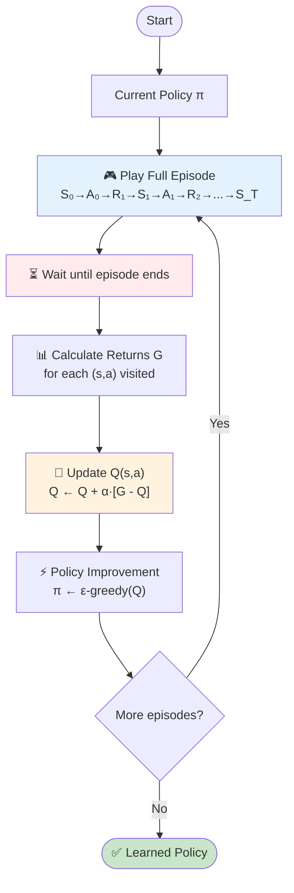
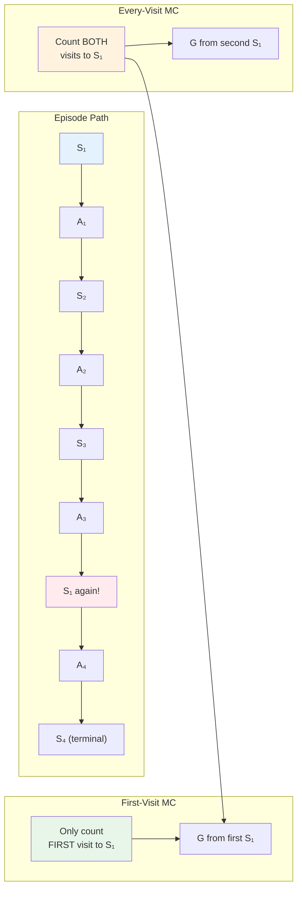
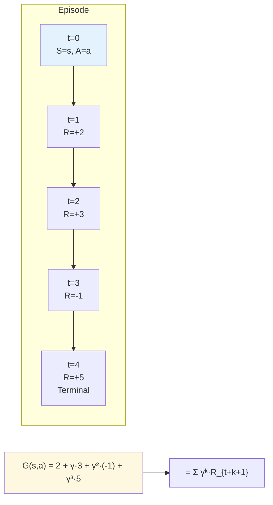
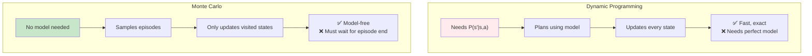
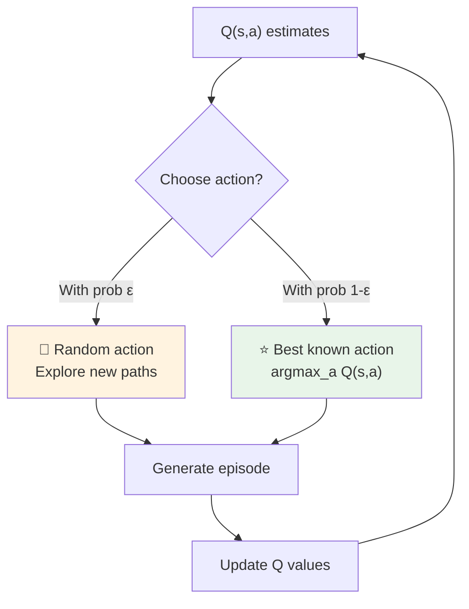
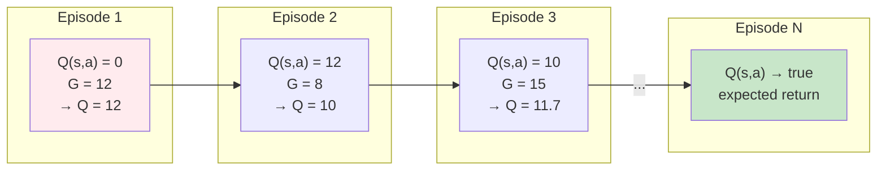

# Chapter 6: Monte Carlo Methods — Learning from Experience

> *"Play the whole game, then learn from the final score."*

---

## Table of Contents

1. [The Core Idea](#1-the-core-idea)
2. [How Monte Carlo Works](#2-how-monte-carlo-works)
3. [First-Visit vs Every-Visit MC](#3-first-visit-vs-every-visit-mc)
4. [The MC Update Rule](#4-the-mc-update-rule)
5. [Visual Intuition](#5-visual-intuition)
6. [Pseudocode](#6-pseudocode)
7. [Pros & Cons](#7-pros--cons)
8. [One-Sentence Takeaways](#8-one-sentence-takeaways)

---

## 1. The Core Idea

**Monte Carlo (MC) methods** solve the reinforcement learning problem by **learning directly from experience** — no model of the environment required.

Instead of knowing transition probabilities `P(s'|s,a)`, the agent simply **plays full episodes** (from start to finish), observes what happens, and updates its value estimates based on the **actual returns** received.

> **Key Principle:** The agent doesn't plan ahead using a model. It tries things out, watches the outcome, and learns from the result.

This makes MC **model-free** — a huge advantage over Dynamic Programming, which required perfect knowledge of the MDP.

---

## 2. How Monte Carlo Works

### The Loop

```
1. Generate an episode using current policy π
   (e.g., S₀, A₀, R₁, S₁, A₁, R₂, ..., S_T)

2. For each state-action pair (s,a) visited in the episode:
   - Calculate the return G = sum of discounted rewards from that point onward
   - Update Q(s,a) using G

3. Improve the policy to be greedy w.r.t. Q

4. Repeat
```

> **Important:** MC only updates values **after the episode ends**. You must wait until the game is over before learning anything.

---

## 3. First-Visit vs Every-Visit MC

### First-Visit MC

For each state `s` (or state-action pair), only the **first occurrence** in an episode is used to update the estimate.

```
For episode e:
    For each state s in e:
        If s is visited for the FIRST time in e:
            G = return from first visit to end
            Append G to Returns(s)
    V(s) = average(Returns(s))
```

> **Why?** Later visits to the same state within the same episode are not independent — they depend on the first visit. First-visit gives unbiased estimates.

---

### Every-Visit MC

Every single visit to a state `s` in an episode contributes to the estimate.

```
For episode e:
    For each visit to state s in e:
        G = return from this visit to end
        Append G to Returns(s)
    V(s) = average(Returns(s))
```

> **Trade-off:** Every-visit has lower variance per episode but slightly more bias. In practice, both converge to the same answer.

---

## 4. The MC Update Rule

### For State Values

```
V(s) ← V(s) + α · [G - V(s)]
```

### For Action Values (Q)

```
Q(s,a) ← Q(s,a) + α · [G - Q(s,a)]
```

Where:

| Symbol | Meaning |
|--------|---------|
| `α` | Learning rate (0 < α ≤ 1). With α = 1/N, this becomes the sample average. |
| `G` | Actual return: `G = R_{t+1} + γ·R_{t+2} + γ²·R_{t+3} + ...` |
| `G - Q(s,a)` | **TD Error** — how wrong was our prediction? |

> **Intuition:** If the actual return `G` was higher than expected `Q(s,a)`, increase the estimate. If lower, decrease it.

---

## 5. Visual Intuition

### 5.1 The MC Episode Loop



> **Notice the WAIT step** — MC cannot learn mid-episode. Everything happens after the game ends.

---

### 5.2 First-Visit vs Every-Visit



> First-visit ignores the second occurrence of S₁. Every-visit counts both.

---

### 5.3 Return Calculation



> The return G is the **discounted sum of all future rewards** from the point of visiting (s,a).

---

### 5.4 MC vs DP — The Model-Free Advantage



---

### 5.5 Exploration vs Exploitation in MC



> MC uses **ε-greedy exploration** to ensure all state-action pairs are visited enough times.

---

### 5.6 The Learning Process Over Episodes



> Over many episodes, the Q-estimates converge to the true expected returns.

---

## 6. Pseudocode

### Monte Carlo Control (ε-greedy)

```python
# Initialize
Q = defaultdict(lambda: 0)      # Action-value function
Returns = defaultdict(list)      # Store returns for each (s,a)
pi = epsilon_greedy_policy(Q)   # Behavior policy

for episode in range(num_episodes):
    # Generate episode using pi
    episode_data = []
    s = env.reset()
    while not done:
        a = pi(s)                           # Sample action
        s_next, r, done = env.step(a)
        episode_data.append((s, a, r))
        s = s_next

    # Calculate returns and update Q
    G = 0
    visited = set()
    for t in reversed(range(len(episode_data))):
        s, a, r = episode_data[t]
        G = gamma * G + r                    # Discounted return

        # First-visit check
        if (s, a) not in visited:
            visited.add((s, a))
            Returns[(s, a)].append(G)
            Q[(s, a)] = np.mean(Returns[(s, a)])  # Or incremental update

    # Policy improvement (ε-greedy)
    pi = make_epsilon_greedy(Q, epsilon)

return Q, pi
```

---

## 7. Pros & Cons

```
┌─────────────────────────────────────────────────────────────┐
│                   MONTE CARLO: PROS & CONS                   │
├─────────────────────────────────────────────────────────────┤
│                                                             │
│  ✅ MODEL-FREE                                              │
│     No need to know P(s'|s,a) or R(s,a,s').                 │
│     Just interact with the environment and observe.         │
│                                                             │
│  ✅ UNBIASED ESTIMATES                                      │
│     Uses actual returns G, not bootstrapped estimates.      │
│     Converges to true values with enough episodes.          │
│                                                             │
│  ✅ WORKS FOR EPISODIC TASKS                                │
│     Great for games, puzzles, and any task with a clear     │
│     start and end.                                          │
│                                                             │
├─────────────────────────────────────────────────────────────┤
│                                                             │
│  ❌ MUST WAIT FOR EPISODE END                               │
│     Can't learn mid-episode. If episodes are long or        │
│     infinite, MC doesn't work.                              │
│                                                             │
│  ❌ HIGH VARIANCE                                           │
│     One lucky/unlucky episode can swing estimates wildly.   │
│     Needs many episodes to stabilize.                       │
│                                                             │
│  ❌ ONLY UPDATES VISITED STATES                             │
│     States never visited get no updates. Exploration        │
│     strategy is critical.                                   │
│                                                             │
└─────────────────────────────────────────────────────────────┘
```

---

## 8. One-Sentence Takeaways

- **Monte Carlo** learns by playing full episodes and updating estimates with the actual return — no model needed.
- **First-Visit MC** only counts the first time you see a state in an episode; **Every-Visit MC** counts all occurrences.
- The update rule `Q ← Q + α·[G - Q]` moves your estimate toward the actual observed return.
- MC is **model-free** and **unbiased**, but you must wait until the episode ends and variance can be high.
- If episodes are very long or never-ending, MC won't work — that's where Temporal Difference methods come in.

---

## Analogy Recap

> **Monte Carlo** is like reviewing a full basketball game tape. You watch the whole game (episode), then update your strategy based on whether you won or lost. You don't change your plan mid-game.

---

*End of Chapter 6*
