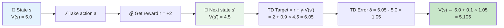
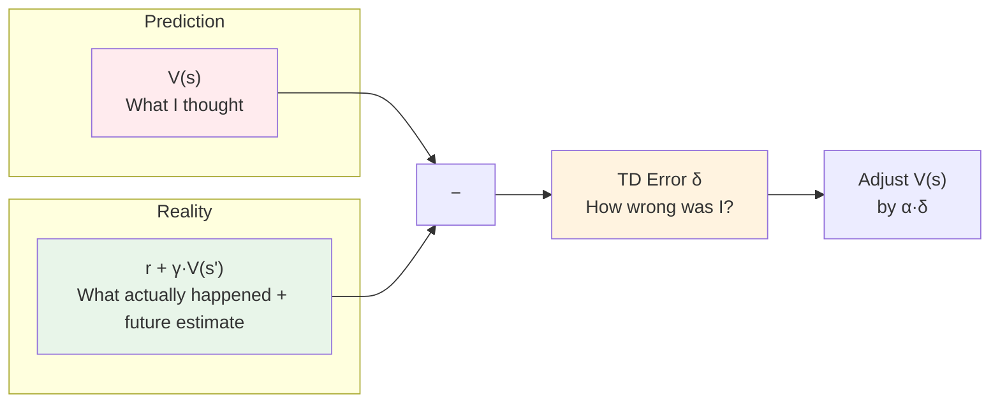
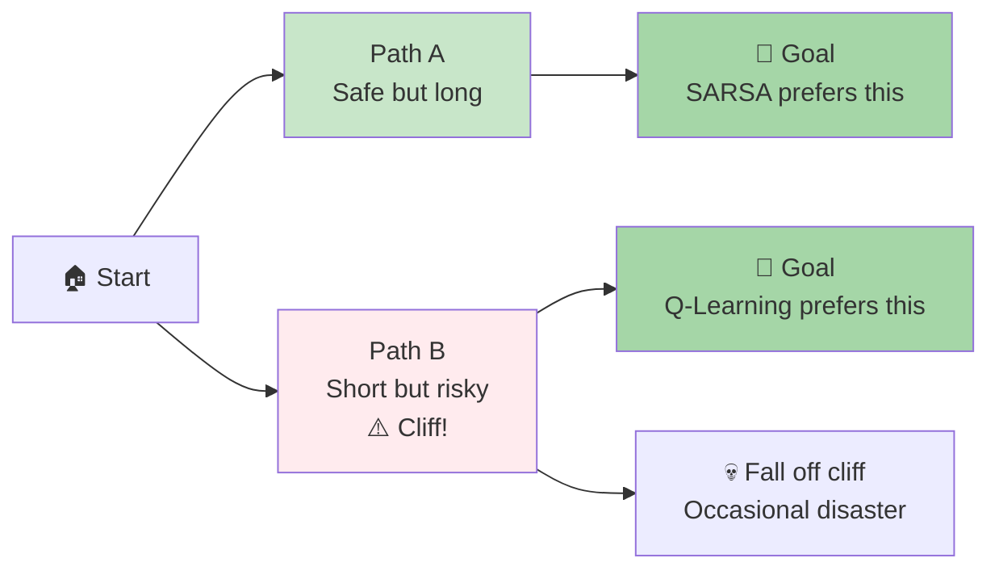
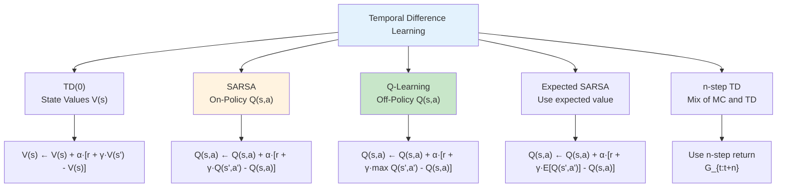

# Chapter 7: Temporal Difference Learning — Learning While You Go

> *"Why wait until the end of the episode? Learn from every single step."*

---

## Table of Contents

1. [The Core Idea](#1-the-core-idea)
2. [TD(0) — Learning State Values](#2-td0--learning-state-values)
3. [SARSA — On-Policy TD Control](#3-sarsa--on-policy-td-control)
4. [Q-Learning — Off-Policy TD Control](#4-q-learning--off-policy-td-control)
5. [On-Policy vs Off-Policy](#5-on-policy-vs-off-policy)
6. [Visual Intuition](#6-visual-intuition)
7. [Pseudocode](#7-pseudocode)
8. [MC vs TD Comparison](#8-mc-vs-td-comparison)
9. [One-Sentence Takeaways](#9-one-sentence-takeaways)

---

## 1. The Core Idea

**Temporal Difference (TD) learning** combines the best of both worlds:

- Like **Monte Carlo**, it is **model-free** — no need to know transition probabilities.
- Like **Dynamic Programming**, it **bootstraps** — it updates estimates based on other estimates.

> **The key difference from MC:** TD learns **after every step**, not after every episode. You don't need to wait for the game to end to update your knowledge.

This makes TD incredibly powerful for:
- Continuous tasks (no episodes)
- Long episodes (don't want to wait)
- Real-time learning (adjust on the fly)

---

## 2. TD(0) — Learning State Values

### The Update Rule

```
V(s) ← V(s) + α · [r + γ·V(s') - V(s)]
```

| Term | Name | Meaning |
|------|------|---------|
| `r + γ·V(s')` | **TD Target** | "What I think the return should be" — immediate reward + discounted value of next state |
| `r + γ·V(s') - V(s)` | **TD Error (δ)** | How wrong was my prediction? |
| `α` | Learning rate | How much to adjust the estimate |

> **Intuition:** After taking action `a` in state `s`, you receive reward `r` and land in state `s'`. You expected the value of `s` to be `V(s)`, but the actual experience suggests it should be closer to `r + γ·V(s')`. Adjust `V(s)` toward this new target.

---

## 3. SARSA — On-Policy TD Control

### The Update Rule

```
Q(s,a) ← Q(s,a) + α · [r + γ·Q(s',a') - Q(s,a)]
```

> **SARSA** = **S**tate, **A**ction, **R**eward, **S**tate, **A**ction — the five things used in the update.

### How it works

1. In state `s`, take action `a` (using your current policy, e.g., ε-greedy)
2. Observe reward `r` and next state `s'`
3. In state `s'`, take action `a'` (again, using your current policy)
4. Update `Q(s,a)` using `r + γ·Q(s',a')`

> **Key:** SARSA learns about the policy it is **actually following** (including exploration). If you explore randomly, SARSA learns that random exploration is part of the policy.

---

## 4. Q-Learning — Off-Policy TD Control

### The Update Rule

```
Q(s,a) ← Q(s,a) + α · [r + γ·maxₐ' Q(s',a') - Q(s,a)]
```

### How it works

1. In state `s`, take action `a` (can be exploratory, e.g., random)
2. Observe reward `r` and next state `s'`
3. Look at **all possible actions** in `s'` and pick the **maximum** Q-value
4. Update `Q(s,a)` using `r + γ·max Q(s',a')`

> **Key:** Q-Learning learns about the **optimal policy** regardless of what actions you actually take. You can explore randomly (ε-greedy) but still learn the best possible strategy.

---

## 5. On-Policy vs Off-Policy

| Aspect | SARSA (On-Policy) | Q-Learning (Off-Policy) |
|--------|-------------------|------------------------|
| **Update uses** | `Q(s',a')` where `a'` is the action **actually taken** | `maxₐ' Q(s',a')` — the **best possible** action |
| **Learns about** | The policy being followed (including exploration) | The optimal policy |
| **Behavior policy** | Same as target policy | Can be different (e.g., ε-greedy exploration) |
| **Risk tolerance** | More conservative (accounts for exploration mistakes) | More aggressive (assumes perfect future actions) |
| **Cliff Walking** | Learns safer path (avoids cliff) | Learns optimal but risky path (hugs cliff) |

---

## 6. Visual Intuition

### 6.1 The TD Update — Step by Step



> After one step, we update our estimate of `V(s)` based on what just happened.

---

### 6.2 MC vs TD — When Do You Learn?

```mermaid
graph TB
    subgraph "Monte Carlo"
        MC1["Step 1"] --> MC2["Step 2"] --> MC3["Step 3"] --> MC4["Step 4"] --> MC5["Step 5<br/>🏁 Episode End"]
        MC5 --> MC_LEARN["🎓 Learn!<br/>Update using G"]
        style MC_LEARN fill:#ffebee
    end

    subgraph "Temporal Difference"
        TD1["Step 1"] --> TD_LEARN1["🎓 Learn!<br/>Update V(s₁)"]
        TD_LEARN1 --> TD2["Step 2"] --> TD_LEARN2["🎓 Learn!<br/>Update V(s₂)"]
        TD_LEARN2 --> TD3["Step 3"] --> TD_LEARN3["🎓 Learn!<br/>Update V(s₃)"]
        TD_LEARN3 --> TD4["Step 4"] --> TD_LEARN4["🎓 Learn!<br/>Update V(s₄)"]
        TD_LEARN4 --> TD5["Step 5<br/>🏁 Episode End"]

        style TD_LEARN1 fill:#c8e6c9
        style TD_LEARN2 fill:#c8e6c9
        style TD_LEARN3 fill:#c8e6c9
        style TD_LEARN4 fill:#c8e6c9
    end
```



> **MC waits** until the episode ends. **TD learns at every step.**

---

### 6.3 SARSA vs Q-Learning

```mermaid
graph TB
    subgraph "SARSA (On-Policy)"
        S1["State s"] --> A1["Action a<br/>(from current policy)"]
        A1 --> R1["Reward r"]
        R1 --> SP1["State s'"]
        SP1 --> AP1["Action a'<br/>(from current policy)"]
        AP1 --> UPDATE1["Q(s,a) ← Q(s,a) + α·[r + γ·Q(s',a') - Q(s,a)]"]

        style UPDATE1 fill:#e3f2fd
    end

    subgraph "Q-Learning (Off-Policy)"
        S2["State s"] --> A2["Action a<br/>(can be random!)"]
        A2 --> R2["Reward r"]
        R2 --> SP2["State s'"]
        SP2 --> MAX["maxₐ' Q(s',a')<br/>(best action, regardless)"]
        MAX --> UPDATE2["Q(s,a) ← Q(s,a) + α·[r + γ·max Q(s',a') - Q(s,a)]"]

        style UPDATE2 fill:#fff3e0
    end
```



> SARSA uses the action you **actually took** next. Q-Learning uses the **best possible** action next.

---

### 6.4 The TD Error



> The TD error measures the gap between prediction and (bootstrapped) reality.

---

### 6.5 On-Policy vs Off-Policy — The Cliff Walking Example



> **SARSA** (on-policy) learns to avoid the cliff because it accounts for the occasional exploratory stumble. **Q-Learning** (off-policy) learns the shortest path, assuming perfect future actions — but may fall off the cliff during exploration.

---

### 6.6 The TD Learning Family



---

## 7. Pseudocode

### TD(0) for State Values

```python
V = {s: 0 for s in states}

for episode in range(num_episodes):
    s = env.reset()
    while not done:
        a = policy(s)                       # Choose action
        s_next, r, done = env.step(a)

        # TD(0) Update
        td_target = r + gamma * V[s_next]
        td_error = td_target - V[s]
        V[s] += alpha * td_error

        s = s_next
```

### SARSA (On-Policy)

```python
Q = defaultdict(lambda: 0)

for episode in range(num_episodes):
    s = env.reset()
    a = epsilon_greedy(Q, s, epsilon)

    while not done:
        s_next, r, done = env.step(a)
        a_next = epsilon_greedy(Q, s_next, epsilon)

        # SARSA Update
        td_target = r + gamma * Q[(s_next, a_next)]
        td_error = td_target - Q[(s, a)]
        Q[(s, a)] += alpha * td_error

        s, a = s_next, a_next
```

### Q-Learning (Off-Policy)

```python
Q = defaultdict(lambda: 0)

for episode in range(num_episodes):
    s = env.reset()

    while not done:
        a = epsilon_greedy(Q, s, epsilon)   # Explore!
        s_next, r, done = env.step(a)

        # Q-Learning Update
        td_target = r + gamma * max(Q[(s_next, a)] for a in actions)
        td_error = td_target - Q[(s, a)]
        Q[(s, a)] += alpha * td_error

        s = s_next
```

---

## 8. MC vs TD Comparison

```
┌─────────────────────────────────────────────────────────────┐
│              MONTE CARLO  vs  TEMPORAL DIFFERENCE            │
├─────────────────────────────────────────────────────────────┤
│                                                             │
│   MONTE CARLO                    TEMPORAL DIFFERENCE        │
│   ───────────                    ───────────────────        │
│                                                             │
│   ❌ Wait for episode end        ✅ Learn every step        │
│                                                             │
│   ✅ Unbiased (true returns)     ❌ Biased (bootstraps)     │
│                                                             │
│   ❌ High variance               ✅ Lower variance          │
│                                                             │
│   ❌ Can't do continuous tasks   ✅ Works for any task      │
│                                                             │
│   ✅ Simple to understand        ✅ More efficient          │
│                                                             │
│   Both are: MODEL-FREE — no need for P(s'|s,a)             │
│                                                             │
└─────────────────────────────────────────────────────────────┘
```

---

## 9. One-Sentence Takeaways

- **TD learning** updates estimates after every step by bootstrapping — combining real rewards with estimated future values.
- **TD(0)** learns state values `V(s)` using the one-step lookahead target `r + γ·V(s')`.
- **SARSA** is **on-policy** — it learns the value of the policy it is actually following, including exploration.
- **Q-Learning** is **off-policy** — it learns the optimal policy while potentially exploring randomly.
- The **TD Error** `δ = r + γ·V(s') - V(s)` is the driving force behind all TD updates.
- **MC = unbiased but waits. TD = biased but fast. Both are model-free.**

---

## Analogy Recap

> **MC** = "I'll finish the recipe, taste the dish, then adjust."
>
> **TD** = "I taste at every step. Too salty? I adjust the salt *now*."
>
> **SARSA** = "I learn from what I actually did."
>
> **Q-Learning** = "I learn from what I *should have* done (the best move)."

---

*End of Chapter 7*
