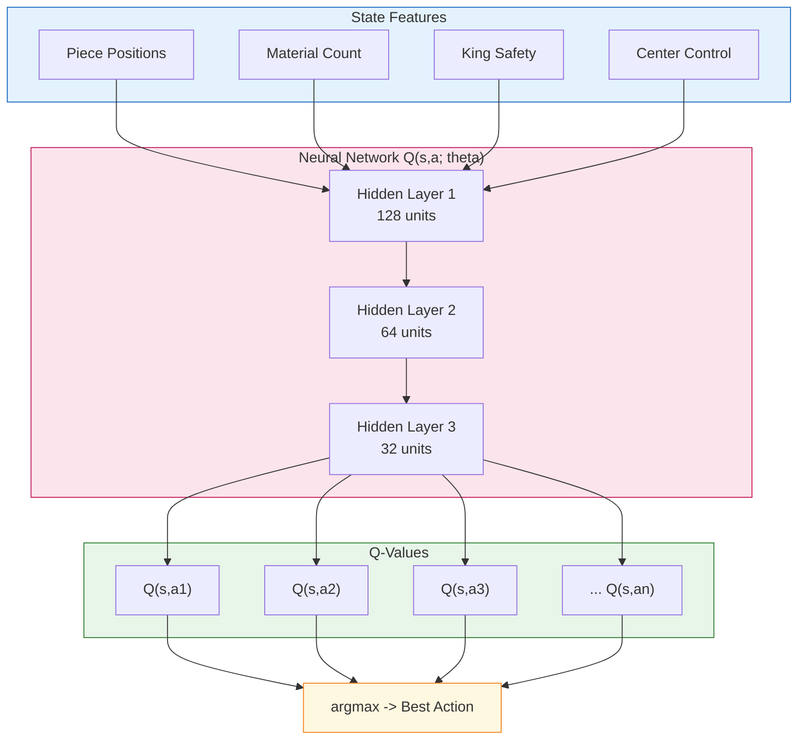

# 📘 Chapter 8: Function Approximation — When States Are Too Many

> *A Q-table is like memorizing every possible chess board. Impossible. A neural network is like learning **patterns**: "If my pieces control the center, that's good." It generalizes to boards it's never seen.*

---

## 🌀 The Curse of Dimensionality

Chess has approximately **10^47** possible board states. Storing a Q-table for every state-action pair is physically impossible — not just impractical, but beyond the atoms in the observable universe.

| Approach | Memory | Scalability |
|----------|--------|-------------|
| Q-Table | O(|S| x |A|) | Fails catastrophically |
| Function Approximation | O(parameters) | Scales gracefully |

**The insight:** Instead of memorizing every Q(s,a), we learn a **function** that estimates Q-values from state features.

---

## 🏗️ Neural Network Q-Approximator



---

## ⚖️ Linear vs Neural Network Approximation

```mermaid
flowchart LR
    subgraph Linear["Linear Approximation"]
        L1["Q(s,a) = w1*f1(s) + w2*f2(s) + ... + wn*fn(s)"]
        L2["Simple and interpretable"]
        L3["Fast to compute"]
        L4["Requires hand-crafted features"]
        L5["Cannot capture non-linear patterns"]
    end

    subgraph Neural["Neural Network Approximation"]
        N1["Q(s,a) = NeuralNetwork(s; theta)"]
        N2["Learns features automatically"]
        N3["Universal function approximator"]
        N4["Captures complex non-linearities"]
        N5["Needs more data and compute"]
    end

    Linear -->|"Limited Expressiveness"| Neural

    style Linear fill:#e3f2fd,stroke:#1565c0
    style Neural fill:#fce4ec,stroke:#c2185b
```



### Linear Approximation
- **Formula:** `Q(s,a) = sum(w_i * f_i(s))`
- Weights `w` are updated via gradient descent
- Features `f(s)` must be hand-engineered
- **Best for:** Simple problems where you know what matters

### Neural Network Approximation
- **Formula:** `Q(s,a) = NN(s; theta)`
- Weights `theta` are learned end-to-end
- Features are learned automatically from raw input
- **Best for:** Complex, high-dimensional problems (images, game screens, sensor data)

---

## 🔄 Deep Q-Learning Training Loop

```mermaid
sequenceDiagram
    participant E as Environment
    participant A as Agent
    participant B as Replay Buffer
    participant T as Target Network

    loop Episode
        E->>A: State s (features)
        A->>A: Forward pass to Q(s,a1..an)
        A->>E: Epsilon-greedy action a
        E->>A: Reward r, Next state s'
        A->>B: Store (s, a, r, s')
    end

    loop Training Step (every N steps)
        B->>A: Sample mini-batch
        A->>T: Compute target y = r + gamma * max Q(s',a'; theta-)
        T->>A: Return target values
        A->>A: Loss = MSE(y, Q(s,a; theta))
        A->>A: Backprop and Update theta
        Note over A: theta- copied from theta periodically
    end
```

### Key Components

| Component | Purpose |
|-----------|---------|
| **Experience Replay** | Breaks correlation in sequential data; reuses past experiences |
| **Target Network** | Stabilizes learning by freezing target Q-values during updates |
| **Epsilon-Greedy** | Balances exploration vs. exploitation |
| **Gradient Descent** | Minimizes (target - prediction)^2 to update network weights |

---

## 🚀 Why This Changes Everything

```mermaid
flowchart LR
    subgraph Before["BEFORE"]
        B1["Grid Worlds"]
        B2["Tic-Tac-Toe"]
        B3["Small discrete spaces"]
    end

    subgraph Bridge["Function Approximation"]
        direction TB
        NN["Neural Networks"]
        FA["Generalization"]
        SC["Scalability"]
    end

    subgraph After["AFTER"]
        A1["Chess / Go"]
        A2["Robotics"]
        A3["Self-Driving Cars"]
        A4["Atari Games (pixels)"]
        A5["Continuous Control"]
    end

    Before --> Bridge --> After

    style Before fill:#ffebee,stroke:#c62828
    style Bridge fill:#fff8e1,stroke:#f57f17
    style After fill:#e8f5e9,stroke:#2e7d32
```



| Era | What We Could Do | What We Couldn't |
|-----|------------------|------------------|
| **Tabular Q-Learning** | Grid worlds, small MDPs | Anything with >10^6 states |
| **Function Approximation** | Chess, Go, Atari, robotics | Nothing — this unlocked everything |

---

## 📝 Summary

1. **The Problem:** State spaces are too big for tables.
2. **The Solution:** Approximate Q(s,a) with a function.
3. **Linear:** Fast but limited; needs hand-crafted features.
4. **Neural Networks:** Powerful; learns features from raw data.
5. **The Impact:** Makes RL viable for real-world, high-dimensional problems.

> *Function approximation is the bridge from toy problems to the real world.*

---

## 🔗 Further Reading

- **DQN Paper:** Mnih et al., "Playing Atari with Deep Reinforcement Learning" (2013)
- **Double DQN:** Van Hasselt et al. (2015)
- **Dueling DQN:** Wang et al. (2015)
- **Rainbow:** Hessel et al. (2017) — combines 6 improvements
