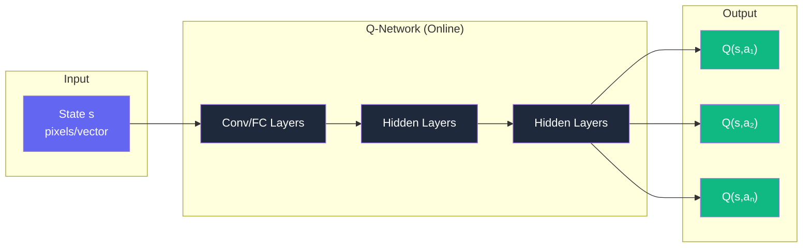
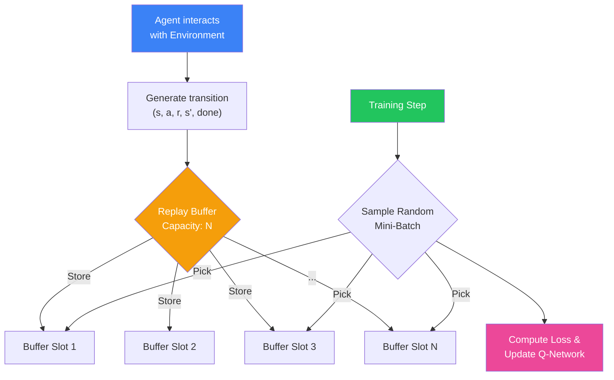
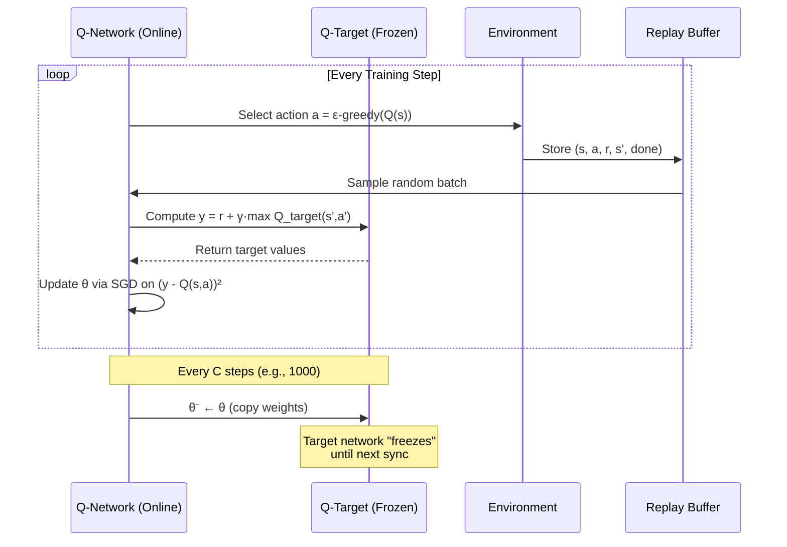
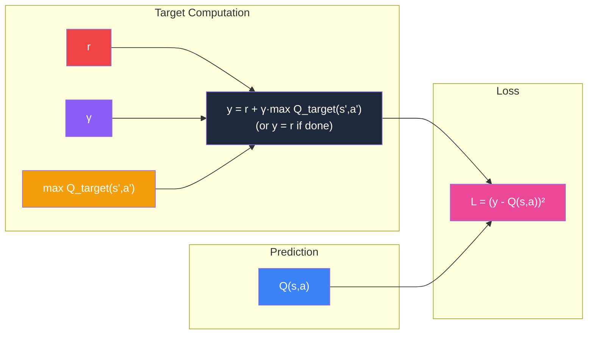
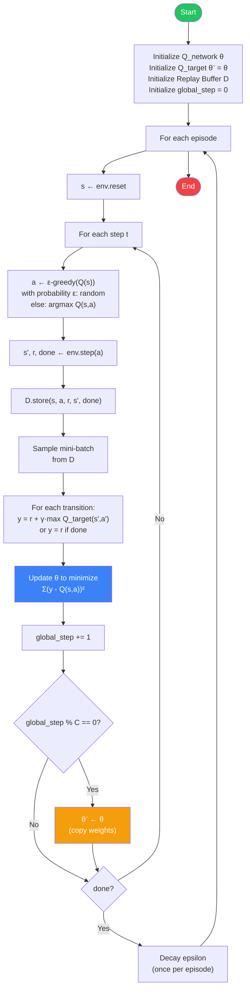

# Chapter 9: Deep Q-Networks (DQN) — RL Meets Deep Learning

> **Prerequisite**: You should understand Q-Learning (Chapter 8) before reading this chapter.

---

## 📌 Table of Contents

1. [Core Concepts](#core-concepts)
2. [DQN Architecture](#dqn-architecture)
3. [Experience Replay](#experience-replay)
4. [Target Network](#target-network)
5. [Loss Function & Bellman Update](#loss-function--bellman-update)
6. [The DQN Algorithm](#the-dqn-algorithm)
7. [Simple Analogies](#simple-analogies)
8. [Key Hyperparameters](#key-hyperparameters)
9. [Further Reading](#further-reading)

---

## Core Concepts

| Concept | Description |
|---------|-------------|
| **DQN** | Uses a deep neural network to approximate `Q(s,a)` instead of a Q-table. |
| **Experience Replay** | Stores past transitions `(s, a, r, s', done)` in a buffer. Training samples random batches to break correlation between consecutive experiences. |
| **Target Network** | A separate "frozen" network used to compute Q-targets. Copied from the main Q-network every `C` steps. Stabilizes training. |
| **Loss Function** | `L = (r + γ·max Q_target(s',a') − Q(s,a))²` |

---

## DQN Architecture



**How it works:**
1. Feed state `s` into the neural network
2. Network outputs Q-values for **all** actions
3. Pick action with highest Q-value (exploit) or random action (explore)

---

## Experience Replay



### Why Experience Replay?

| Problem | Solution |
|---------|----------|
| Consecutive samples are highly correlated | Random sampling breaks correlation |
| Each experience used only once | Reuse experiences multiple times |
| Non-stationary data distribution | Averaged distribution over many states |

---

## Target Network



### Why Target Network?

Without a target network:
- `Q(s,a)` chases its own moving shadow
- Creates a **moving target problem** → instability & divergence

With a target network:
- `Q_target` provides **stable bootstrap targets**
- Reduces oscillations during training
- "Dog chasing its own tail" → "Student learning from a stable teacher"

---

## Loss Function & Bellman Update



**Bellman Equation for DQN:**
```
y = r + γ · max Q_target(s', a')      if not done
y = r                                   if done

Loss = MSE(y, Q_network(s, a))
```

---

## The DQN Algorithm



### Pseudocode

```python
# 1. Initialize
Q_network = NeuralNetwork()      # Main network with weights θ
Q_target = copy(Q_network)       # Target network with weights θ⁻ = θ
replay_buffer = ReplayBuffer(capacity=N)

global_step = 0                  # persists across episodes — used for target sync

# 2. Training Loop
for episode in range(M):
    state = env.reset()
    for t in range(T):
        # ε-greedy action selection
        if random() < epsilon:
            action = env.action_space.sample()    # Explore
        else:
            action = argmax(Q_network(state))      # Exploit

        next_state, reward, done = env.step(action)

        # Store experience
        replay_buffer.store(state, action, reward, next_state, done)

        # Sample and train
        if len(replay_buffer) > batch_size:
            batch = replay_buffer.sample(batch_size)

            targets = []
            for s, a, r, s_next, done_flag in batch:
                if done_flag:
                    y = r
                else:
                    y = r + gamma * max(Q_target(s_next))
                targets.append(y)

            # Gradient descent on MSE loss
            loss = MSE(targets, Q_network(batch.states, batch.actions))
            Q_network.update(loss)

        # Sync target network every C GLOBAL steps (not per-episode step count!)
        global_step += 1
        if global_step % C == 0:
            Q_target.copy_weights_from(Q_network)

        state = next_state
        if done:
            break

    # Decay epsilon ONCE PER EPISODE (matches the ε_decay definition in the
    # hyperparameter table below: "Exploration decay per episode")
    epsilon = max(epsilon_min, epsilon * epsilon_decay)
```

> ⚠️ **Common implementation pitfalls**
> 1. **Target sync counter reset bug** — if you use the per-episode loop variable `t` for `t % C == 0`, the sync fires near the start of *every* episode (since `t` restarts at 0 each episode) instead of every `C` steps overall. Always use a persistent `global_step` counter.
> 2. **Epsilon decay placement** — decaying `epsilon` inside the inner step loop decays it every environment step, not every episode. That contradicts the "decay per episode" definition used throughout this chapter and produces a much faster, unintended exploration schedule. Decay it once, after the episode's step loop ends.

---

## Simple Analogies

> **Experience Replay** = *"Instead of learning only from what just happened, I keep a diary of all my experiences and randomly re-read pages."*

> **Target Network** = *"I have a 'stable teacher' who doesn't change their mind every second. I compare my guesses to the teacher's answers."*

---

## Key Hyperparameters

| Parameter | Symbol | Typical Value | Purpose |
|-----------|--------|---------------|---------|
| Discount Factor | γ | 0.95 - 0.99 | Weight of future rewards |
| Epsilon (start) | ε | 1.0 | Initial exploration rate |
| Epsilon (min) | ε_min | 0.01 | Minimum exploration rate |
| Epsilon decay | ε_decay | 0.995 | Exploration decay per episode |
| Replay Buffer Size | N | 10,000 - 1,000,000 | Max stored transitions |
| Batch Size | B | 32 - 64 | Samples per training step |
| Target Sync Frequency | C | 500 - 10,000 | Steps between target network updates |
| Learning Rate | α | 0.0001 - 0.001 | SGD step size |

---

## Further Reading

- **Original DQN Paper**: Mnih et al. (2015) — "Human-level control through deep reinforcement learning" (Nature)
- **Double DQN**: Van Hasselt et al. (2016) — Decouples action selection from evaluation
- **Dueling DQN**: Wang et al. (2016) — Separates value and advantage streams
- **Prioritized Experience Replay**: Schaul et al. (2016) — Samples important transitions more frequently

---

*End of Chapter 9*
